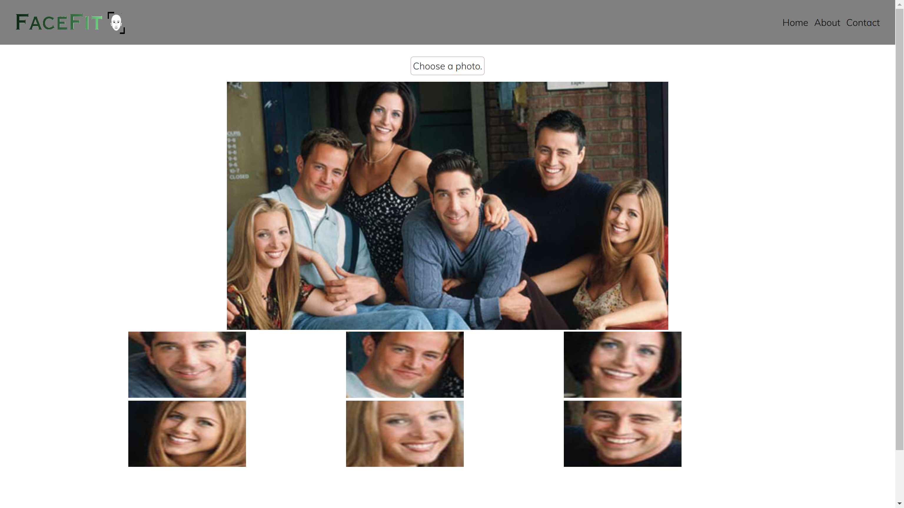

# Face Fit

Face Fit crops detected faces in images by using face-api.js and tf.js.

# Demo
https://buraksekili.github.io/face-fit/

# Note

Face Fit uses client side face detection (tf.js based model). Therefore, app fetches models (/public/models) while page is downloading which takes a couple of seconds.

# Screenshots

  
  

